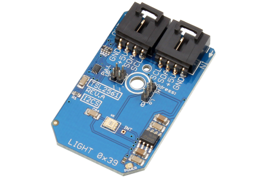

[](https://www.controleverything.com/content/Light?sku=TSL2561_I2CS)
# TSL2561
TSL2561 Light-to-Digital Converter

The TSL2561 is a light-to-digital converter that transforms light intensity to a digital signal output.

This Device is available from ControlEverything.com [SKU: TSL2561_I2CS]

https://www.controleverything.com/content/Light?sku=TSL2561_I2CS

This Sample code can be used with Raspberry Pi, Arduino, Beaglebone Black and Onion Omega.

## Java
Download and install pi4j library on Raspberry pi. Steps to install pi4j are provided at:

http://pi4j.com/install.html

Download (or git pull) the code in pi.

Compile the java program.
```cpp
$> pi4j TSL2561.java
```

Run the java program.
```cpp
$> pi4j TSL2561
```

## Python
Download and install smbus library on Raspberry pi. Steps to install smbus are provided at:

https://pypi.python.org/pypi/smbus-cffi/0.5.1

Download (or git pull) the code in pi. Run the program.

```cpp
$> python TSL2561.py
```

## Arduino
Download and install Arduino Software (IDE) on your machine. Steps to install Arduino are provided at:

https://www.arduino.cc/en/Main/Software

Download (or git pull) the code and double click the file to run the program.

Compile and upload the code on Arduino IDE and see the output on Serial Monitor.


## C

Download (or git pull) the code in Beaglebone Black.

Compile the c program.
```cpp
$>gcc TSL2561.c -o TSL2561
```
Run the c program.
```cpp
$>./TSL2561
```

## Onion Omega

Get Started and setting up the Onion Omega according to steps provided at :

https://wiki.onion.io/Get-Started

To install the Python module, run the following commands:
```cpp
opkg update
```
```cpp
opkg install python-light pyOnionI2C
```

Download (or git pull) the code in Onion Omega. Run the program.

```cpp
$> python TSL2561.py
```

#####The code output is the lux value of ambient light.
